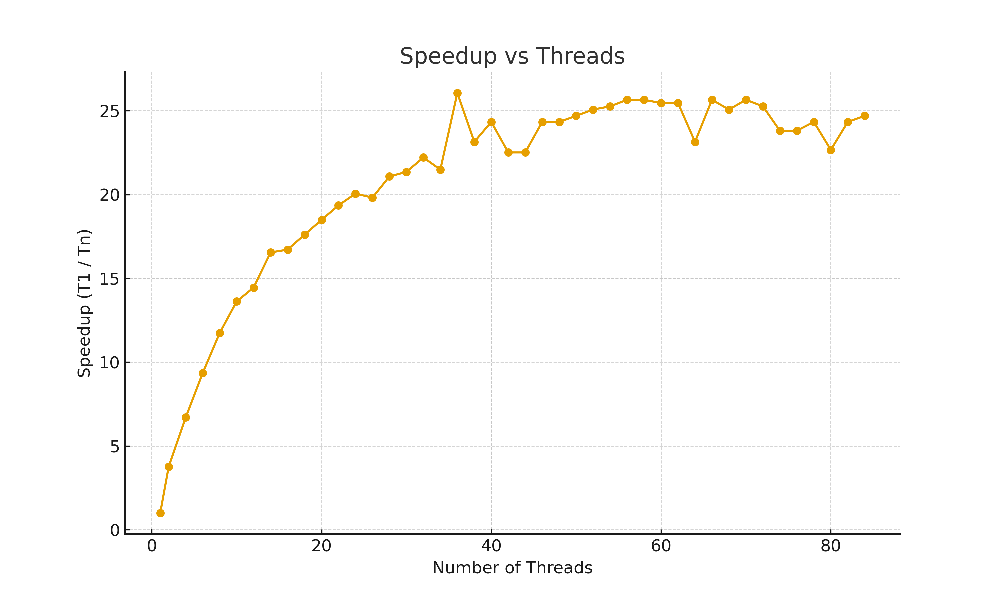
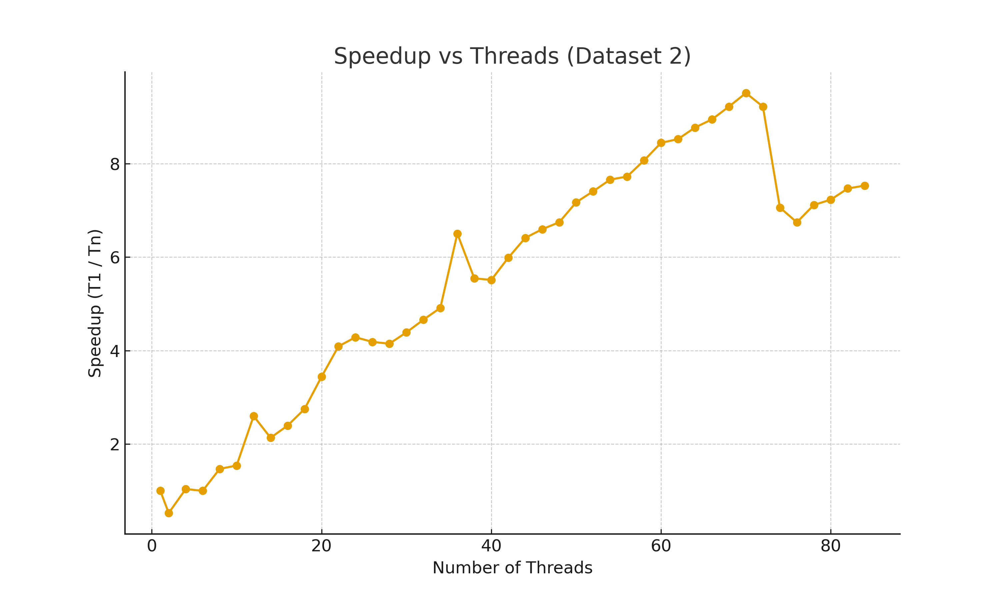

# Computing Mean Problems

## Create a graph plotting number of thread along the X-axis and speedup along the Y-axis using your favorite method for creating graphs. 

## For the graph, note the shape of the curve. Does it “converge” to some general value? What’s the maximum speedup you got from threading? What happens when you use more cores than are available in the hardware?

The graph goes up very quickly for the first 1 -> 32 threads, but then sort of flatlines a little bit and doesnt achieve much more efficiency. The maximum speed up that I calculated happened around 36 threads where it peaked at a speedup of 26.06x. After going over the amount of avaiable cores, it seems that it just stop getting faster, and possibly gets slightly slower. 

## Considering the number of cores in the system, do you get a linear scaling of performance as you add more cores?

We definitely do not get a linear scaling of performance as you add cores but looks more like a log graph, where it accerlates quicker at the beginning and then falls off quite hard and doesn't increase too much after a certain point.

## Looking at your graph, what value would you proposed for p, and describe how you arrived at that value.

# Computing Volume Problems

## Again collect the runtimes, and compute the speedups, and graph the results.

 

## Do you get similar performance curve to threaded.out?

 The answer is NO. This graph is much more linear than the threaded.out results. There is a relatively linear trend throughout the whole graph, except for small differences and spikes. But, after running `lscpu` on blue, I see this

    Thread(s) per core:   2
    Core(s) per socket:   18
    Socket(s):            2

This basically show that there are 72 threads on the blue server and therefore, once the amount of threads that we reach on the graph reaches 72 there is a steep decline. This could be a coincidence, but it is much more likely that once you exceed the total number of threads available with you program it causes a drastic reduction in computational speed. This is evident in the graph where you can see a decline in the speedup once it hits 72 threads. This combined with the different graphs show that there is a very different performance curve.

