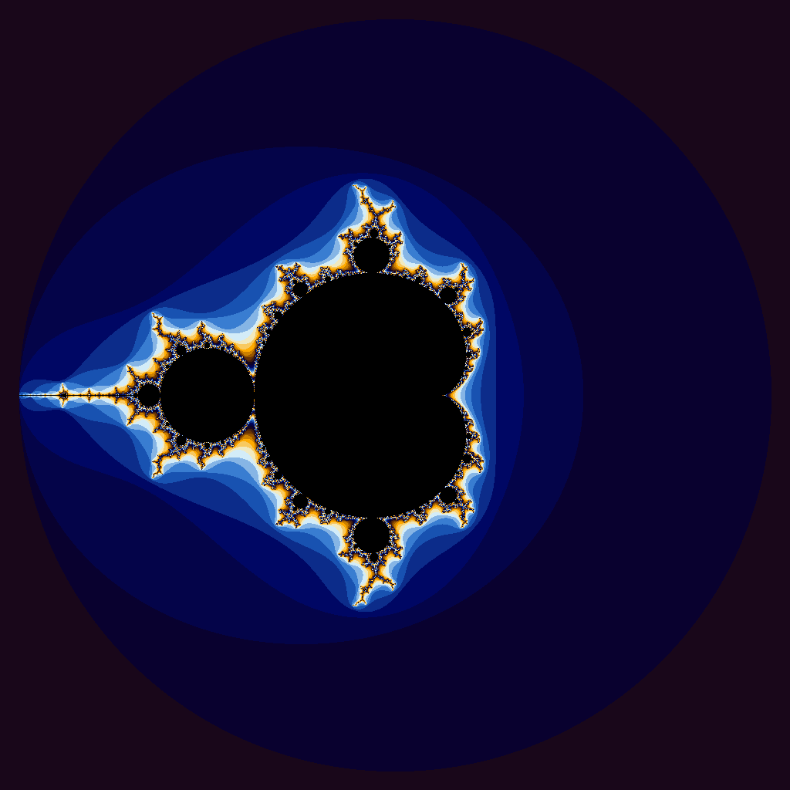

## Iota GPU Test Results

jbaxter@vm50e3b08ddde69:~/Project-4$ ./runTrials.sh ./iota.gpu
|Vector Length|Wall Clock Time|User Time|System Time|
|:--:|--:|--:|--:|
|10| 0.15| 0.03| 0.11|
|100| 0.10| 0.00| 0.09|
|1000| 0.12| 0.00| 0.10|
|10000| 0.11| 0.00| 0.10|
|100000| 0.10| 0.00| 0.09|
|1000000| 0.12| 0.01| 0.10|
|5000000| 0.15| 0.01| 0.12|
|100000000| 0.73| 0.16| 0.57|
|500000000| 3.10| 0.66| 2.43|
|1000000000| 6.62| 1.83| 4.78|
|5000000000|46.58|10.39|36.18|

## Iota CPU Test Results

jbaxter@vm50e3b08ddde69:~/Project-4$ ./runTrials.sh ./iota.cpu
|Vector Length|Wall Clock Time|User Time|System Time|
|:--:|--:|--:|--:|
|10| 0.00| 0.00| 0.00|
|100| 0.00| 0.00| 0.00|
|1000| 0.00| 0.00| 0.00|
|10000| 0.00| 0.00| 0.00|
|100000| 0.00| 0.00| 0.00|
|1000000| 0.00| 0.00| 0.00|
|5000000| 0.03| 0.00| 0.02|
|100000000| 0.58| 0.09| 0.49|
|500000000| 2.94| 0.47| 2.47|
|1000000000| 5.86| 0.95| 4.90|
|5000000000|36.52| 6.20|30.31|

# Are the results what you expected?
No the results are not what I expected. From what I know about GPU and how fast they are I thought that this would be a relatively easy task, but it took longer in all categories, especially the ones with the smaller amount of operations.

# Speculate as to why it looks like CUDA isn’t a great solution for this problem.
What I think the reason for the GPU version being slower than the CPU version is the copy operations. Since the GPU is doing the computing it must send its information back to the CPU and these operations are much more costly than if it were to just be computed on the CPU. This means that if you just did the operations in the CPU to begin with you can disregard the overhead caused by transfering the computations from the GPU to the CPU.

# It wouldn't show up in the README for a .ppm file so I converted it to a png, but the .ppm file is still in the Project-4 directory.
